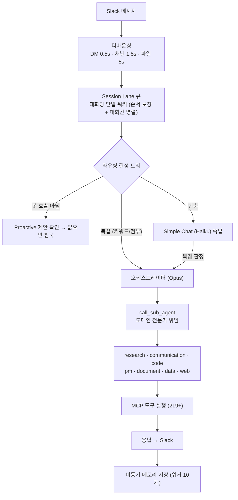

# MOCO — AI Coworker Platform


**Slack에 상주하는 AI 동료.** 데스크톱 앱 하나를 설치하면 백그라운드에서 Python AI 서버가 떠서,
동료가 던진 메시지를 받아 역할별 전문 에이전트가 협업해 처리하고, Gmail·Google Workspace·Jira·
Confluence·CRM·전화까지 219개+ 도구를 자율적으로 사용한다. 단순 챗봇이 아니라 **라우팅 →
멀티 에이전트 오케스트레이션 → 메모리 → 능동적 제안**을 갖춘, 약 50K LOC 규모의 프로덕션 시스템.

> **포트폴리오 공개본** — 이 저장소는 실무 프로젝트에서 회사·고객·개인 식별 정보(사내 데이터, 실사용
> 메모리·녹취·DB, 규제 문서 코퍼스, 하드코딩 크리덴셜)를 모두 제거하고 코드 아키텍처만 남긴 버전입니다.
> 전화(AICC)·데모 CRM 시드 데이터 등 회사 특화 데이터는 포함하지 않으며, 모든 시크릿은 환경변수로 주입됩니다.

---

## Demo

여섯 개의 실제 업무 자동화 장면. 한 문장 지시가 여러 도구(캘린더·Drive·Docs·Gmail·ClickUp·Slack)를
가로질러 하나의 결과물로 끝난다.

| 미팅 전날 준비 | 발표자료 제작 | 스레드 → 문서화 |
|:---:|:---:|:---:|
| <video src="https://raw.githubusercontent.com/asj000221-debug/moco-ai-coworker/main/docs/videos/demo_meeting_prep.mp4" controls width="260"></video> | <video src="https://raw.githubusercontent.com/asj000221-debug/moco-ai-coworker/main/docs/videos/demo_slide_deck.mp4" controls width="260"></video> | <video src="https://raw.githubusercontent.com/asj000221-debug/moco-ai-coworker/main/docs/videos/demo_thread_to_doc.mp4" controls width="260"></video> |
| 내일 일정 확인 → 아젠다 초안 → Slack DM | PPT 생성 → Google Drive 저장 | 스레드 의사결정을 Google Docs로 정리 |

| 스프린트 마감 보고서 | 신규 팀원 온보딩 | 주간 브리핑 |
|:---:|:---:|:---:|
| <video src="https://raw.githubusercontent.com/asj000221-debug/moco-ai-coworker/main/docs/videos/demo_sprint_report.mp4" controls width="260"></video> | <video src="https://raw.githubusercontent.com/asj000221-debug/moco-ai-coworker/main/docs/videos/demo_onboarding.mp4" controls width="260"></video> | <video src="https://raw.githubusercontent.com/asj000221-debug/moco-ai-coworker/main/docs/videos/demo_weekly_briefing.mp4" controls width="260"></video> |
| Google Docs 리포트 자동 작성 | Drive 문서 + 캘린더 일정 + 환영 메일 | Drive·캘린더·ClickUp·Gmail 종합 → Slack 발송 |

> 영상이 바로 안 보이면 [docs/videos/](docs/videos/) 에서 직접 재생할 수 있습니다.

---

## What is MOCO

설치된 데스크톱 앱이 사용자의 유일한 화면이다. 앱은 시작 버튼을 누르면 `uv run python -m app.main`으로
Python AI 서버를 백그라운드에 띄우고 그 생명주기를 관리한다. 서버 안에서는 네 축이 동시에(asyncio) 돈다.

```
Electron 앱 (설정 GUI · 실시간 로그 · 대시보드)
   └─ Python AI 서버 (asyncio)
        ① Slack Socket Mode   실시간 메시지 수신·응답      (핵심)
        ② APScheduler         이메일/Jira/Confluence 주기 감시 (능동)
        ③ FastAPI :8000       웹·음성·전화·CRM·자체 MCP 서버
        ④ ClawOps 070 전화    AICC 상담
```

핵심 메시지는 하나다 — **에이전트 두뇌는 Claude를 빌리되, 그것들이 협업·기억·선제 행동·자가 확장하게
만드는 오케스트레이션 레이어는 직접 설계·구현했다.** 동료를 한 명 더 채용하는 게 아니라, AI 한 명이
회사 안에서 24시간 살면서 메일·전화·문서·코드·고객 응대를 동시에 처리하고, 필요한 도메인이 생기면
자기가 또 다른 동료를 만들어내는 시스템.

---

## Why it exists

단일 거대 프롬프트는 컨텍스트가 폭주하고, 도구가 많아질수록 정확도가 떨어진다. 그래서 문제를 **계층적으로
분해**했다: 가벼운 분류기(Haiku)가 앞에서 걸러내고, 복잡한 일만 오케스트레이터(Opus)로 올라가며,
오케스트레이터는 혼자 다 하지 않고 도메인 전문 서브에이전트에게 위임한다. 작업 난이도별로 Haiku/Sonnet/
Opus 3-티어를 갈아 끼워 비용·속도·정확도를 동시에 잡는다.

그리고 이 시스템은 **API 키 없이 동작한다** — 뒤의 [인증 모델](#인증-모델--api-키-없이-동작) 참고.
이 설계가 "앱 설치만으로 동작(Zero-Setup)"을 가능하게 하는 핵심이고, 대신 한도가 계정 레이트리밋이라
견고성 장치들(세마포어·컨텍스트 자동 압축·재시도)이 필요해졌다.

---

## Agentic Runtime Model

MOCO의 심장은 **메시지 한 건이 처리되는 일생**이다.



1. **수신 & 디바운싱** — 끊어 보낸 메시지를 `{채널}:{유저}` 키로 짧게 모아 하나로 병합. 같은 요청에 LLM을 여러 번 부르는 낭비 방지.
2. **Session Lane** — 대화 단위 독립 큐 + 단일 워커. 같은 대화는 순서대로, 다른 대화는 병렬로. 고정 워커풀과 달리 락 경합이 없다. 15분 유휴 시 워커가 스스로 종료.
3. **라우팅 결정 트리** — 봇이 호출됐는지, 인가된 사용자인지, 복잡한지(약 60개 키워드 8개 카테고리 또는 첨부파일)를 판정해 simple/complex 경로를 정한다.
4. **오케스트레이터** — Observer가 30초마다 진행 하트비트를 보내고, 관련 메모리를 검색해 프롬프트에 실어준다. 하드 타임아웃 20분.
5. **서브에이전트 협업** — `call_sub_agent`로 도메인 전문가에게 위임. 결과는 표준 스키마(`status/summary/data/artifacts/next_suggestions/error`)로 회수. 병렬은 `TaskExecutor`, 중간 결과는 `TaskWorkspace` 공유 메모리에 네임스페이스로 쌓아 다음 에이전트에 넘긴다.
6. **응답 & 기억** — 최종 응답을 올린 뒤 대화는 별도 메모리 큐로 넘어가 비동기 저장 — 사용자를 기다리게 하지 않는다.

---

## Features

**멀티 에이전트 오케스트레이션.** 분류기(Haiku) → 오케스트레이터(Opus) → 도메인 서브에이전트 7종(research /
communication / code / pm / document / data / web). 각 서브에이전트는 자기 일에 필요한 MCP 도구만
화이트리스트로 받는다. 실패 시 최대 2회 재계획(replan).

**순수 Python 메모리 시스템.** 검색에 LLM을 쓰지 않는다. JSON 인덱스 토큰 스코어링(제목·태그·채널/유저
가중치)으로 즉시 후보를 찾고, 없으면 파일 스캔으로 키워드 점수를 매긴다. 빠르고 공짜. 저장 판단도 규칙
기반이라 잡담에 불필요한 LLM 호출을 막는다.

**능동(Proactive) 시스템.** APScheduler가 이메일(5분)·Jira(30분)·Confluence(60분)를 주기 감시하고,
2단계 패턴(수집 → LLM 분석)으로 할 일을 만든다. Dynamic Suggester(15분)는 메모리를 분석해 요청 전에
먼저 제안한다.

**자동 에이전트 생성 (Agent Factory).** MOCO가 사용 패턴을 감지해 새 에이전트를 직접 제안·생성·검증·
publish 한다. "AI가 코드를 자유롭게 쓴다"는 위험은 **템플릿의 정해진 5개 슬롯만 채우게** 해서 차단한다
(구문 오류 불가능). 생성 코드는 격리 디렉토리(`generated/`)에 들어가 try/except로 로딩되므로 하나가
깨져도 서버 전체는 무사하다. 6단계 검증(슬롯 채우기 → 임시 저장 → py_compile+격리 import → dry-run →
atomic move → hot reload) + 사람 승인 게이트.

**양방향 확장성.** (안) Google Drive에 SKILL.md를 올리면 런타임에 능력이 추가되는 Skill Marketplace.
(밖) MOCO 자신이 `/mcp` 엔드포인트로 MCP 서버를 노출해, 팀원이 자기 Claude에서 MOCO 능력을 직접
호출한다. 인증은 정적 토큰 + OAuth 2.1 (PKCE + DCR).

**멀티 채널 진입점.** Slack · ChatGPT 스타일 웹 챗 · 070 전화(AICC) · Twilio · 브라우저/Gemini Live
음성. 웹 챗에는 도구·인용·결정 권한을 제한한 도메인 전문 에이전트(법령 자문 등)를 모달로 분리했다.

**견고성.** 서브에이전트 동시 실행 세마포어(20)로 레이트리밋 폭주 방지, 컨텍스트 오버플로우 감지 시
`/compact` 자동 실행 후 재시도, SDK 초기화 지수 백오프 재시도, graceful shutdown.

**운영 모니터링 (Daemon Plane).** 모든 에이전트 실행을 JSONL로 기록하고 `/daemon/` 대시보드에서
업타임·실행 통계·세션·리소스를 본다.

---

## 인증 모델 — API 키 없이 동작

자주 받는 질문: "API 키도 안 넣었는데 어떻게 Claude를 쓰지?" MOCO는 **Anthropic API를 직접 부르지
않고 `claude` CLI를 거친다.**

```
MOCO (claude-agent-sdk)
  └─ ClaudeSDKClient → claude CLI(자식 프로세스) 실행 → stdio로 대화
                          └─ CLI가 자기 저장소의 로그인 토큰으로 인증·모델 라우팅
```

SDK는 HTTP 클라이언트가 아니라 Claude Code CLI를 서브프로세스로 띄운다. `claude`로 한 번 로그인하면
토큰이 CLI 저장소(`~/.claude/`·OS 키체인)에 캐시되고, MOCO가 매번 CLI를 띄우면 그 로그인 상태를 그대로
상속한다. 그래서 MOCO 설정에 `ANTHROPIC_API_KEY`가 없다. (대안: `CLAUDE_CODE_USE_VERTEX=1`로 GCP
서비스계정을 통한 Vertex AI 인증.) 둘 다 Anthropic API 키가 필요 없다.

---

## Project Structure

```
moco-ai-coworker/
└─ app/                        # Python AI 서버
   ├─ main.py                  # 부팅·워커·스케줄러 등록
   ├─ cc_slack_handlers.py     # Slack 이벤트 → 라우팅 결정 트리
   ├─ queueing_extended.py     # Session Lane 동시성
   ├─ cc_agents/               # 에이전트들
   │  ├─ orchestrator/ operator/       # 복잡작업 총괄 (Opus)
   │  ├─ simple_chat/ bot_call_detector/  # 경량 분류 (Haiku)
   │  ├─ sub_agents/{research,communication,code,pm,document,data,web}/
   │  ├─ memory_retriever/ memory_manager/  # 순수 Python 검색 / 저장
   │  ├─ agent_factory/ generated/     # 자동 에이전트 생성 + 격리 로더
   │  ├─ atticus/ ra_regulatory_expert/  # 도메인 전문 에이전트 (웹 챗)
   │  └─ task_executor.py workspace.py   # 병렬 실행 / 공유 메모리
   ├─ cc_checkers/             # Proactive 체커 (outlook, atlassian, skill_sync)
   ├─ cc_tools/                # MCP 도구 구현 (slack, google, crm, phone…)
   ├─ cc_mcp/                  # 자체 MCP 서버 (JSON-RPC + OAuth 2.1)
   ├─ cc_utils/                # SDK 재시도·프롬프트·메모리 인덱스·Daemon Plane
   ├─ cc_web_interface/        # FastAPI: 웹 챗 · 음성 · CRM · AICC 콘솔
   └─ config/settings.py       # Pydantic 설정 + 피처 플래그
```

---

## Quick Start

이 공개본은 아키텍처 열람용입니다. 실제 구동에는 Slack 앱, `claude` CLI 로그인, 각 MCP 자격증명이 필요합니다.

```bash
uv sync                              # 의존성 설치
cp app/config/env/dev.env.example app/config/env/dev.env   # 설정 채우기
uv run python -m app.main            # 서버 기동
```

모델·MCP·체커·웹/음성·Agent Factory 등 모든 기능은 `settings.py`의 피처 플래그(`*_ENABLED`)로 켜고 끈다.
시크릿은 전부 환경변수(`dev.env` / `~/.moco/config.env`)로 주입되며, 코드에 하드코딩된 키는 없다.

---

## Development

```bash
uv run python dev.py                 # 핫 리로드 개발 서버
uv run python -m py_compile app/**/*.py   # 구문 점검
uv run black app/                    # 포매팅
```

---

## Notes

- **Zero-Setup 철학** — 비개발자가 터미널 없이 데스크톱 앱만으로 배포·운영하는 것을 목표로 설계됨. 이
  공개본에는 Electron 앱과 빌드 산출물은 포함하지 않았다.
- **데이터 거버넌스** — 실사용 데이터, 학습/운영 상태, 회사·고객·개인 식별 정보, 규제 문서 코퍼스, 하드코딩
  크리덴셜은 모두 제거했다. CRM 데모 시드, 전화(AICC) 시나리오 등 회사 특화 데이터는 스텁으로 대체했다.
- **라이선스** — Apache 2.0.

<sub>실무 프로젝트를 포트폴리오 열람용으로 재구성한 저장소입니다.</sub>
