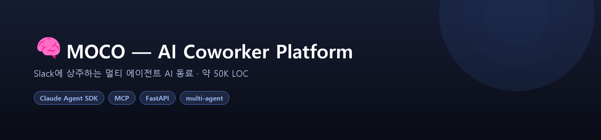
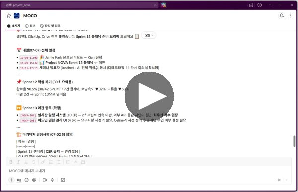
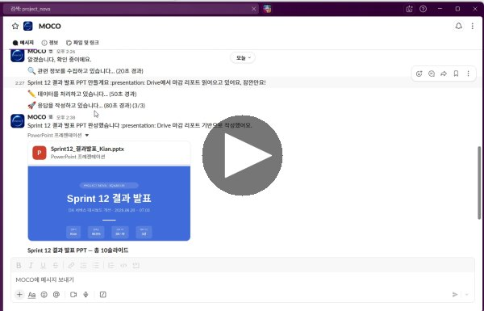
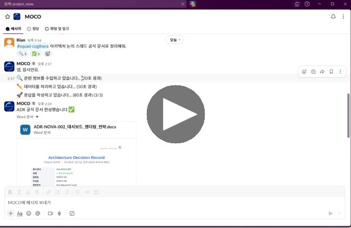
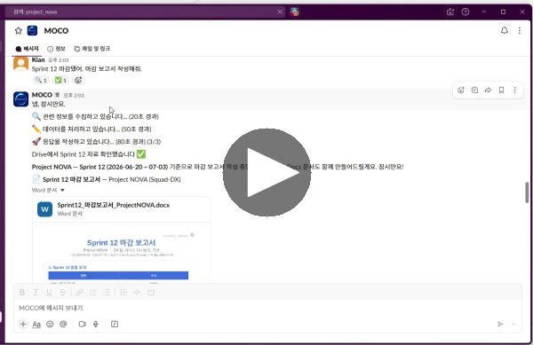
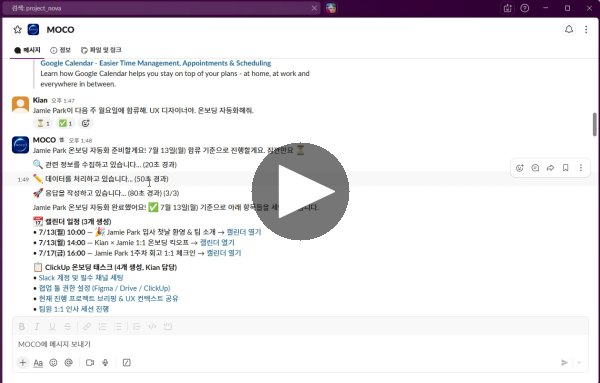
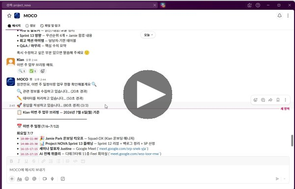
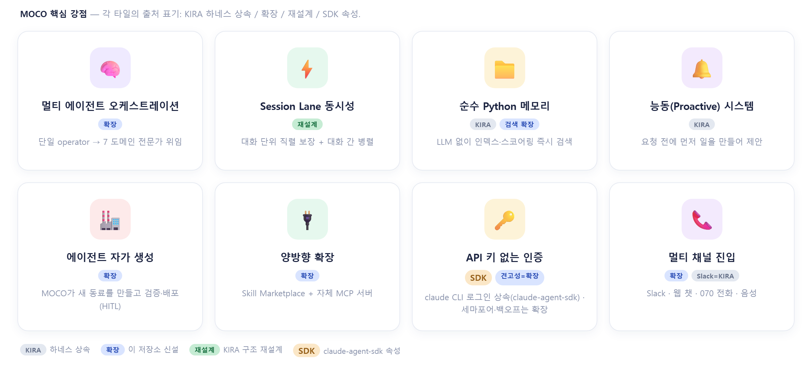
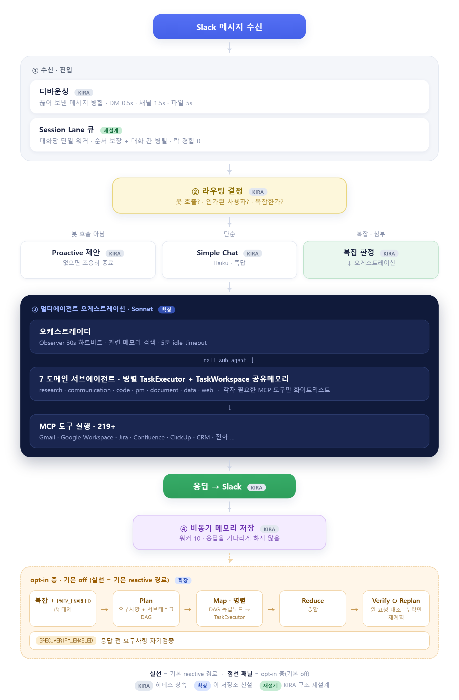
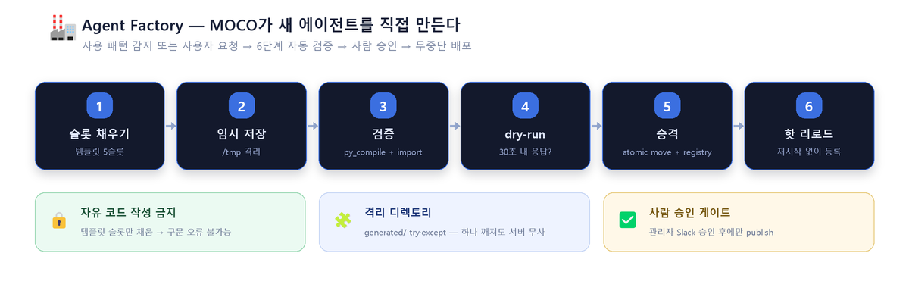

<p align="center">
  
</p>

# MOCO — AI Coworker Platform


**KRAFTON의 [KIRA-Slack](https://github.com/krafton-ai/KIRA)(Apache-2.0) 하네스를 받아, 사내에서 프로덕션으로 확장·운영한 저장소.**
KIRA는 `분류기 → 단일 operator → 메모리 → 프로액티브`라는 에이전트 런타임을 준다. 그 위에 **멀티 에이전트
오케스트레이션 · 동시성 재설계 · 플랫폼화(실시간 음성 · MCP 서버 · 평가 하네스)** 를 얹어, Slack·Gmail·Google
Workspace·Jira·Confluence·ClickUp·CRM·전화까지 219개+ 도구를 다루는 약 50K LOC 시스템으로 굴렸다.

이 문서는 그래서 **KIRA 하네스가 어디까지이고, 그 위에 무엇을 어떻게 확장했는지**를 구분해 정리한 것이다. 확장분 약 38K LOC(웹/관리자 대시보드·도구 래퍼 다수 포함).

> **기반 · 라이선스** — 에이전트 런타임 하네스·Slack 연동·분류(단일 `operator`)·메모리/프로액티브 서브시스템·모델 티어
> 라우팅·앱 스캐폴드는 [KIRA-Slack](https://github.com/krafton-ai/KIRA)(Apache-2.0)에서 파생했다. 파생 범위와 변경
> 내역은 [`NOTICE`](NOTICE), 라이선스는 [`LICENSE`](LICENSE) 참조.
>
> **공개본 범위** — 실무 저장소에서 회사·고객·개인 식별 정보(사내 데이터, 실사용 메모리·녹취·DB, 규제 문서 코퍼스,
> 하드코딩 크리덴셜)를 제거하고 코드 아키텍처만 남긴 버전이다. 전화(AICC)·CRM 시드 등 회사 특화 데이터는 스텁으로
> 대체했고, 모든 시크릿은 환경변수로 주입된다.

---

## Demo

한 문장 지시가 여러 도구(캘린더·Drive·Docs·Gmail·ClickUp·Slack)를 가로질러 하나의 결과물로 끝나는 실제 업무 장면 — 썸네일을 클릭하면 데모 영상이 재생됩니다.

<div align="center">
<table>
  <tr>
    <td align="center" valign="top">
      <a href="https://github.com/user-attachments/assets/0b139be7-54cb-4eb9-aa92-c677a3142633"></a><br/>
      <b>미팅 전날 준비</b><br/><sub>캘린더 확인 · 아젠다 초안 · Slack DM</sub>
    </td>
    <td align="center" valign="top">
      <a href="https://github.com/user-attachments/assets/f492b5f5-bd10-4e7a-9b5a-0532283ac13e"></a><br/>
      <b>발표자료 제작</b><br/><sub>PPT 생성 · Google Drive 저장</sub>
    </td>
    <td align="center" valign="top">
      <a href="https://github.com/user-attachments/assets/2b053a9e-69c1-4ab4-b7f3-cbde1a13f3d7"></a><br/>
      <b>스레드 → 문서화</b><br/><sub>의사결정을 Google Docs로 정리</sub>
    </td>
  </tr>
  <tr>
    <td align="center" valign="top">
      <a href="https://github.com/user-attachments/assets/cfe1b1a9-b7aa-43eb-95a4-3be3ff272b6d"></a><br/>
      <b>스프린트 마감 보고서</b><br/><sub>Google Docs 리포트 자동 작성</sub>
    </td>
    <td align="center" valign="top">
      <a href="https://github.com/user-attachments/assets/ca3f9cb8-3f30-49ce-829e-b6d0cf33d205"></a><br/>
      <b>신규 팀원 온보딩</b><br/><sub>Docs 생성 · 캘린더 등록 · 환영 Gmail</sub>
    </td>
    <td align="center" valign="top">
      <a href="https://github.com/user-attachments/assets/a65fd77f-f217-4052-8a84-eb7b16326797"></a><br/>
      <b>주간 브리핑</b><br/><sub>Drive · 캘린더 · ClickUp · Gmail 종합 → Slack</sub>
    </td>
  </tr>
</table>
</div>

---

## 왜 확장했나

KIRA 하네스는 컨텍스트 폭주와 도구 과다를 **계층적 분해**로 다룬다 — 분류기가 앞에서 걸러내고, 복잡한 일만 실행
에이전트(`operator`)로 올린다(KIRA는 이 복잡작업 경로를 큐·워커 계층에서 "orchestrator"로 부른다). 사내에서 실사용하며
관측한 한계는 두 가지였다: (1) 한 `operator`가 리서치·문서·코드·응대를 한 컨텍스트에서 다 처리하면 도메인이 늘수록 실패가
**어디서 났는지 국소화되지 않는다.** (2) 동시 대화가 늘면 공유 워커풀(`num_workers`)에서 경합이 관측된다(우리 워크로드 기준).

그래서 그 **단일 `operator`를, 오케스트레이터가 도메인 서브에이전트 7종에 위임(`call_sub_agent`)하는 멀티에이전트로
재구성**했다. 오케스트레이션(복잡작업 라우팅) 자체는 KIRA에 있고, **이 저장소가 신설한 것은 위임 기구** — `call_sub_agent`,
도메인 서브에이전트 7종, 실패 시 재계획 — 로, 한 컨텍스트에 뭉쳐 있던 일을 도메인별로 갈라 각 단계를 독립적으로 관측·검증할 수
있게 했다. 동시성은 KIRA의 공유 워커풀을 **Session Lane**(대화당 단일 워커)으로 재설계했고, 모델 티어도 **분류기 Haiku ·
오케스트레이터 Sonnet**으로 재조정했다(KIRA 기본값은 분류기 Sonnet · 복잡작업 Opus). 인증은 KIRA와 마찬가지로 claude
CLI 로그인을 상속해 [**API 키 없이 동작한다**](#인증-모델--api-키-없이-동작).

**이 확장이 실제로 하는 일:**
- **실패 국소화 · 관측성** — 오케스트레이터가 서브에이전트에 위임하고 각자 표준 스키마(`status/summary/data/artifacts/error`)로 회수하므로, 실패가 *어느 에이전트·어느 단계*에서 났는지 드러난다(한 컨텍스트에 뭉쳐 있을 땐 불가능했던 국소화). `cc_eval`의 credit assignment(leave-one-out)로 "어느 서브에이전트 탓인지"까지 오프라인 채점한다.
- **도구 정확도 · 권한 표면↓** — 219개 MCP 도구를 한 에이전트에 다 노출하는 대신, 서브에이전트마다 **도메인에 필요한 도구만 화이트리스트**로 받는다(research·communication·code·pm·document·data·web). 후보를 좁혀 도구 선택 정확도를 올리고, 각 요청이 만질 수 있는 권한 표면을 줄인다.
- **의존 작업의 결과 전달** — 복잡 요청이 서브태스크 DAG로 분해되면, 독립 노드는 `TaskExecutor.execute_dag`가 **병렬 실행**하고 선행(`deps`) 결과는 공유 **`TaskWorkspace`**로 후행 서브에이전트에 전달된다(기본 reactive 경로는 순차 위임, DAG 병렬·PMRV는 opt-in).
- **비용 · 지연↓** — 티어 재조정(분류 Haiku · 오케스트레이터 Sonnet)으로 KIRA 기본값(Sonnet/Opus) 대비 상시 비용·지연을 낮췄고, 메모리 검색은 LLM 왕복 없이 JSON 토큰 스코어링(추가 토큰 0)으로 회수한다.
- **동시성 정합** — Session Lane이 대화 내 순서를 **락 없이** 보장하면서(레인이 곧 순서) 대화 간에는 병렬 처리하고, 유휴 레인은 자가 종료해 동시성이 고정 풀이 아니라 활성 대화 수에 따라 늘어난다.

<p align="center">
  
</p>

---

## 확장 범위 — KIRA 하네스 위에서

분류기 · 단일 `operator` · 메모리 · 프로액티브 · 메시지 큐 · 모델 티어 라우팅 · 인증 골격은 KIRA-Slack 하네스가 제공한다. 이 저장소는 그 하네스 위에 다음을 신설·확장했다.

| 영역 | 이 저장소가 한 일 |
|---|---|
| **멀티 에이전트 오케스트레이션** | 오케스트레이터 + 도메인 서브에이전트 7종 위임(`call_sub_agent`)·재계획 · 병렬 `TaskExecutor` + 공유 `TaskWorkspace` |
| **동시성** | Session Lane — 대화당 단일 워커 · 순서 보장 · 유휴 자가종료 |
| **메모리 검색** | LLM-free 검색 (JSON 인덱스 토큰 스코어링) |
| **모델 티어** | 분류기 Haiku · 오케스트레이터 Sonnet |
| **프로액티브 신규 잡** | skill 동기화 · Agent Factory 라이프사이클 · CRM 시퀀스 등 |
| **도구 · 채널** | OAuth 2.1 MCP 서버 · 219 도구 · 실시간 음성(AICC) · 웹/관리자 대시보드 |
| **자가 확장** | Agent Factory (템플릿 슬롯 · 격리 로딩 · HITL 게이트) |
| **견고성** | 서브에이전트 세마포어(20) · SDK 백오프 재시도 |
| **평가** | cc_eval — tool-F1 · pass^k · MAST 실패분류 · credit assignment · LLM-judge |
| **추론 층** (opt-in) | spec-verify · PMRV (Plan-Map-Reduce-Verify-Replan) |

<sub>추론 층은 <code>*_ENABLED</code> opt-in(기본 off)이며 기본 reactive 경로는 무변경 — 뒤 <a href="#agentic-runtime-model">런타임 모델</a> 참조.</sub>

---

## Agentic Runtime Model

메시지 한 건이 수신되어 라우팅·오케스트레이션을 거쳐 응답·저장까지 처리되는 경로.

<p align="center">
  
</p>

<sub>실선 = 기본 reactive 경로(서브에이전트는 <code>call_sub_agent</code> 위임) · 점선 패널 = opt-in PMRV/spec-verify(기본 off).</sub>

1. **수신 & 디바운싱** <sub>KIRA</sub> — 끊어 보낸 메시지를 `{채널}:{유저}` 키로 짧게 병합해 중복 LLM 호출을 막는다.
2. **Session Lane** <sub>확장</sub> — 대화 단위 독립 큐 + 단일 워커. 같은 대화는 순서대로, 다른 대화는 병렬로. 고정 워커풀과 달리 락 경합이 없고, 15분 유휴 시 워커가 스스로 종료한다.
3. **라우팅 결정 트리** <sub>KIRA</sub> — 봇 호출·인가 사용자·복잡도(키워드 8카테고리 또는 첨부)를 판정해 simple/complex 경로를 정한다.
4. **오케스트레이터**(단일 `operator` → 위임형 재구성) <sub>확장</sub> — Observer가 30초마다 진행 하트비트를 보내고 관련 메모리(KIRA 서브시스템)를 프롬프트에 실어준다. 무응답 5분이면 취소·재시도(idle-timeout).
5. **서브에이전트 협업** <sub>확장</sub> — `call_sub_agent`로 도메인 전문가에 위임(기본 경로는 순차). 결과는 표준 스키마(`status/summary/data/artifacts/error`)로 회수하고, 중간 결과는 `TaskWorkspace` 공유 메모리에 쌓아 다음 에이전트로 넘긴다. 병렬 실행기 `TaskExecutor`는 opt-in PMRV의 Map에서 활성화된다.
6. **응답 & 기억** <sub>KIRA</sub> — 최종 응답 후 대화는 별도 메모리 큐로 넘어가 비동기 저장 — 사용자를 기다리게 하지 않는다.

> **opt-in 추론 층** — `PMRV_ENABLED` 시 복잡 요청을 Plan → Map(서브태스크 DAG를 `execute_dag`로 — 독립 노드 병렬 · 선행 결과는 공유 `TaskWorkspace`로 후행에 전달) → Reduce → Verify → (누락 시)Replan 으로 처리하고, `SPEC_VERIFY_ENABLED` 시 응답 전 요구사항 자기검증을 더한다. 기본 off이며, 켜지 않으면 기본 reactive 경로는 그대로다. (자세히는 아래 [확장한 것](#확장한-것) 참조.)

---

## 확장한 것

### 멀티 에이전트 오케스트레이션 <sub>확장</sub>
KIRA의 단일 `operator`를 **오케스트레이터 + 도메인 서브에이전트 7종 위임**(research · communication · code · pm · document · data · web)으로 확장했다. 오케스트레이션(복잡작업 라우팅) 자체는 KIRA에 있고, 신설분은 **위임 기구**(`call_sub_agent` · 서브에이전트 · 재계획)다. 각 서브에이전트는 필요한 MCP 도구만 화이트리스트로 받고 표준 결과 스키마(`status/summary/data/artifacts/error`)로 회수한다. 기본 경로는 순차 위임(`call_sub_agent`)이며, 병렬 실행기 `TaskExecutor`와 PMRV는 opt-in — DAG 분해 시 독립 노드는 `execute_dag`가 병렬 실행하고 선행 결과는 공유 `TaskWorkspace`로 후행 서브에이전트에 전달한다.

### Agent Factory — 자가 확장 <sub>확장</sub>
사용 패턴을 감지해 **새 에이전트를 직접 만들어낸다.** 안전의 주 통제는 **사람 승인(HITL) 게이트**이고, 그 앞단에 템플릿 슬롯(자유 코드 대신 슬롯만 채움) · 6단계 자동 검증을 두어 재시작 없이 로딩한다.

<p align="center">
  
</p>

### 순수 Python 메모리 <sub>KIRA 기반 · LLM-free 검색 확장</sub>
대화를 Markdown으로 누적하되 **검색·저장 판단에 LLM을 쓰지 않는다.** 검색은 JSON 인덱스 토큰 스코어링, 저장 판단은 규칙 기반(명시·지속 신호·도구 사용량) — 빠르고 토큰 비용 0.

### 멀티 채널 · 양방향 확장 <sub>확장 (Slack은 KIRA)</sub>
Slack · 웹 챗 · 070 전화(AICC) · Twilio · 브라우저 음성. **안으로** Drive에 `SKILL.md`를 올리면 런타임에 능력 추가(Skill Marketplace), **밖으로** `/mcp` 엔드포인트로 능력을 노출(정적 토큰 + OAuth 2.1 PKCE/DCR).

### 견고성 · 운영 <sub>KIRA 기반 + 확장</sub>
서브에이전트 동시 실행 **세마포어(20)** · SDK 초기화 지수 백오프(확장), 컨텍스트 오버플로 `/compact` 재시도 · graceful shutdown(KIRA). 모든 실행은 JSONL로 기록되어 `/daemon/` 대시보드에서 조회된다.

### 평가 하네스 (`cc_eval`) <sub>확장</sub>
프로덕션 멀티에이전트의 실패는 대개 조용하다 — 어느 단계·도구·핸드오프에서 틀렸는지 드러나지 않는다. 그래서 런타임 로그를 오프라인에서 객관 채점하는 하네스를 직접 구축했다(런타임 의존 없는 순수 함수 · 단위 테스트). opt-in 실험이 실제로 이득인지도 이 하네스로 판별한다.
- **품질·신뢰도** — tool-call F1(라우팅·도구선택) · **pass^k**(비결정성 하에서 매번 되는가) · bias-controlled LLM-judge(위치편향 스왑) · bootstrap CI · McNemar 짝검정
- **멀티에이전트 진단** — MAST 실패분류 · credit assignment(leave-one-out, 어느 에이전트 탓인지) · handoff 정보손실(entity recall) · 오케스트레이터 격리(routing · decomposition · delegation 분리 평가)

### 검증 중심 추론 층 (opt-in) <sub>확장</sub>
`cc_eval`로 프로덕션 로그를 **오프라인 채점**해 지배 실패모드를 **지시·형식 준수(spec-violation)** 로 진단하고, 이를 겨냥해 두 가지를 설계·구현했다.
- **PMRV** (`PMRV_ENABLED`) — 복잡 요청을 **Plan → (DAG 분해) → 병렬 Map → Reduce → Verify → Replan** 의 검증 중심 파이프라인으로 처리. 독립 서브태스크는 `TaskExecutor`로 병렬 디스패치하고, 검증에서 누락이 잡히면 그 부분만 재계획한다.
- **spec-verify** (`SPEC_VERIFY_ENABLED`) — 응답 제출 전, 원 요청의 요구사항을 항목별로 자기검증.

둘 다 기본 off이며, 켜지 않으면 기본 reactive 경로는 그대로다.

---

## 인증 모델 — API 키 없이 동작

Anthropic API를 직접 호출하지 않고 `claude` CLI를 서브프로세스로 spawn한다.

```
MOCO (claude-agent-sdk)
  └─ ClaudeSDKClient → claude CLI(자식 프로세스) 실행 → stdio로 대화
                          └─ CLI가 자기 저장소의 로그인 토큰으로 인증·모델 라우팅
```

`claude-agent-sdk`는 HTTP 클라이언트가 아니라 CLI를 자식 프로세스로 띄운다. 로그인 토큰이 CLI 저장소(`~/.claude/`·OS
키체인)에 캐시되고, MOCO가 CLI를 spawn할 때 그 인증 상태를 상속하므로 `ANTHROPIC_API_KEY`가 필요 없다(대안:
`CLAUDE_CODE_USE_VERTEX=1` GCP 서비스계정). 이 설계가 "앱 설치만으로 동작"을 가능하게 하고, 대신 한도가 계정
레이트리밋이라 위 견고성 장치들이 필요해졌다.

---

## Project Structure

```
app/                           # Python AI 서버
├─ main.py                     # 부팅·워커·스케줄러 등록
├─ cc_slack_handlers.py        # Slack 이벤트 → 라우팅 결정 트리
├─ queueing_extended.py        # Session Lane 동시성
├─ cc_agents/
│  ├─ orchestrator/ operator/          # 복잡작업 총괄 (Sonnet)
│  ├─ simple_chat/ bot_call_detector/  # 경량 분류 (Haiku)
│  ├─ sub_agents/{research,communication,code,pm,document,data,web}/
│  ├─ memory_retriever/ memory_manager/   # 순수 Python 검색 / 저장
│  ├─ agent_factory/ generated/        # 자동 에이전트 생성 + 격리 로더
│  └─ task_executor.py workspace.py    # 병렬 실행 / 공유 메모리
├─ cc_tools/  cc_mcp/          # MCP 도구 구현 / 자체 MCP 서버(OAuth 2.1)
├─ cc_utils/                   # SDK 재시도·프롬프트·메모리 인덱스·Daemon Plane · opt-in(pmrv·spec-verify)
├─ cc_eval/                    # 평가 하네스 (오프라인·단위테스트)
├─ cc_web_interface/           # FastAPI: 웹 챗 · 음성 · CRM · AICC 콘솔
└─ config/settings.py          # Pydantic 설정 + 피처 플래그
```

기능은 전부 `settings.py`의 `*_ENABLED` 플래그로 켜고 끄며, 시크릿은 환경변수(`dev.env` / `~/.moco/config.env`)로만 주입된다 — 코드에 하드코딩된 키는 없다. 구동에는 Slack 앱·`claude` CLI 로그인·각 MCP 자격증명이 필요하다(`uv sync` → `dev.env` 작성 → `uv run python -m app.main`).

---

<sub>실무 프로젝트를 포트폴리오 열람용으로 재구성한 저장소입니다. 코드 아키텍처 열람이 목적이며, 파생 기반과 변경 내역은 <a href="NOTICE">NOTICE</a>에 명시했습니다.</sub>

<!-- portfolio-footer -->

### 포트폴리오

→ **[전체 프로젝트](https://github.com/sungjin-ahn-dev)**

- **MOCO — AI Coworker Platform** ← 현재 저장소
- [근감소증 예측 멀티모달 ML](https://github.com/sungjin-ahn-dev/sarcopenia-multimodal-ml)
- [DTx 인지훈련 난이도 조정 봇](https://github.com/sungjin-ahn-dev/dtx-adaptive-training-bot)
- [한국어 난독증 읽기평가 엔진](https://github.com/sungjin-ahn-dev/korean-reading-assessment)
- [AICC 음성 상담 서버](https://github.com/sungjin-ahn-dev/aicc-voice-agent)
